# 【AWS】 サーバーレスのウェブアプリケーションを構築する Hands-on

## 概要
このリポジトリは、AWS公式ハンズオン「サーバーレスのウェブアプリケーションを構築する」を、  
**2026年9月23日時点のAWS環境で実施する際に必要となった変更点・補足事項**をまとめたものです。

公式ハンズオンは公開から時間が経過しており、AWS Management Consoleや各AWSサービスの仕様変更により、  
現在の環境では手順どおりに進められない箇所があります。

本リポジトリでは、公式ハンズオンの内容そのものを再掲載するのではなく、  
**公式手順との差分を中心に整理しています。**

新規作成・修正が必要となるファイルは、`hands_on_files` フォルダにまとめています。


### hands_on_files に含まれるファイル

* `aws-exports.js`

  * Amplify CLIによる自動生成が行われなくなったため、新規作成したファイル
* `Lambda/index.mjs`

  * 現行のLambdaランタイムに合わせて修正したファイル

なお、AWS公式リポジトリに既に存在するファイルについては、本リポジトリには重複して配置していません。

> [!IMPORTANT]
> AWSのサービス仕様やManagement Consoleは変更される可能性があります。
>
> 本リポジトリの内容は**2026年9月23日時点**で確認したものです。
>
> 将来的にAWS側の仕様変更により、追加の修正が必要になる可能性があります。

## このハンズオンで学べること

本ハンズオンでは、以下のAWSサービスを組み合わせたサーバーレスWebアプリケーションを構築します。

* Amazon S3 / AWS Amplify Hosting
* Amazon Cognito
* Amazon API Gateway
* AWS Lambda
* Amazon DynamoDB

特に、  
**Cognito → API Gateway → Lambda → DynamoDB**  
という、AWSでよく利用されるサーバーレスアプリケーションの基本構成を実際に構築できます。

## 実施したAWS公式ハンズオン

* [サーバーレスのウェブアプリケーションを構築する](https://aws.amazon.com/jp/getting-started/hands-on/build-serverless-web-app-lambda-apigateway-s3-dynamodb-cognito/)

## AWS公式サンプルリポジトリ

公式ハンズオンで使用されているサンプルコードは、以下のリポジトリから取得します。

* [aws-samples/aws-serverless-webapp-workshop](https://github.com/aws-samples/aws-serverless-webapp-workshop)

> [!NOTE]
> 上記のAWS公式リポジトリは、現在アーカイブされており、読み取り専用となっています。
>
> 本リポジトリでは、同リポジトリに存在するファイルを原則として重複掲載せず、  
> 現在の環境で追加・修正が必要となったファイルのみを `hands_on_files` に配置しています。

## ハンズオンにより構築できる最終成果物
### 1. Webサイトへアクセス

AWS Amplify HostingによってデプロイされたWild RydesのWebサイトへアクセスします。

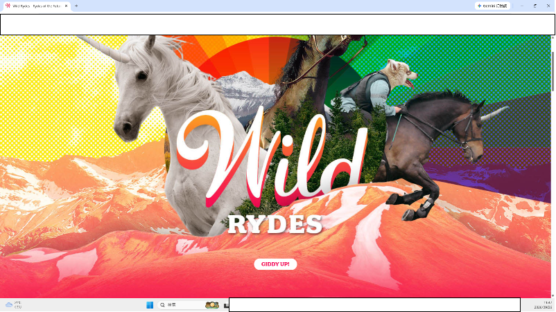

### 2. ログイン

Amazon Cognitoで作成したユーザーでログインします。

> [!NOTE]
> ログインユーザーはAmazon Cognitoのユーザープールで管理します。

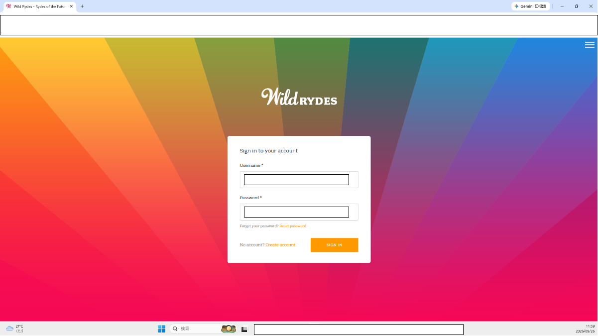

### 3. 地図上にピンを立てる

地図上で乗車場所を選択し、ピンを立てます。

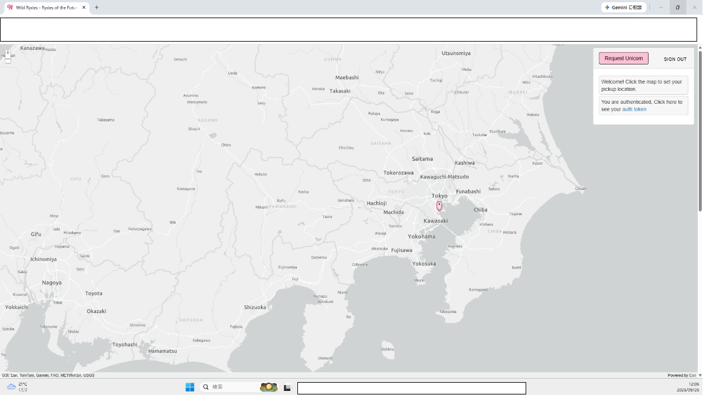

### 4. ユニコーンを呼び出す

「Set Pickup」をクリックすると、地図上の指定した場所にユニコーンが表示されます。

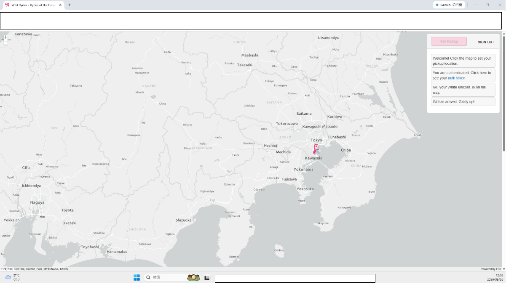

---

# ハンズオン実施環境

| 項目      | 値                      |
| ------- | ---------------------- |
| ローカルマシン | `Windows 11 Home 25H2` |
| pip     | `26.2.1`               |
| Git     | `2.55.0.windows.5`     |
| Node.js | `20.17.0`              |
| npm     | `10.8.2`               |

> [!NOTE]
> 上記は今回のハンズオンを実施した環境です。
>
> 各ツールのバージョンによって動作が異なる可能性があります。

---

# モジュール1: 継続的デプロイを使用した静的ウェブホスティング

## リージョンを選択する

公式手順から変更なし。

## Gitリポジトリを作成する

公式手順から変更なし。

> [!TIP]
> 本ハンズオンではGitリポジトリへの認証にIAM Identity Centerを利用しています。
>
> IAMユーザーの長期的なアクセスキーを使用せず、STSによる一時的な認証情報を利用できます。
>
> ただし、IAM Identity Center自体は本ハンズオンの主題ではないため、  
> 詳細な設定方法については本READMEでは扱いません。

## Gitリポジトリを事前設定する

**変更あり。**

### S3バケットが利用できないため、AWS公式リポジトリからサンプルコードを取得する

公式ハンズオンでは、手順内でS3バケットからサンプルコードを取得します。

現在の環境ではこの手順をそのまま実施できないため、  
AWS公式のサンプルリポジトリから `WildRydesVue` のコードを取得します。

```bash
cd wildrydes-site

git clone https://github.com/aws-samples/aws-serverless-webapp-workshop.git

git subtree split -P resources/code/WildRydesVue -b WildRydesVue

mkdir ../wild-rydes && cd ../wild-rydes

git init

git pull ../aws-serverless-webapp-workshop WildRydesVue

rm -rf amplify

git remote add origin codecommit::ap-northeast-1://serverless-hands-on@wildrydes-site
```

### `amplify` フォルダを削除する

```bash
rm -rf amplify
```

> [!NOTE]
> 公式サンプルにはAmplify CLIを利用したGen 1形式の設定が含まれています。
>
> 今回はAmplify HostingをWebサイトのホスティング用途として利用します。  
>
> CognitoやAPI Gatewayなどのバックエンド設定は、  
> AWS Management Consoleから個別に構築するため、`amplify` フォルダを削除しています。
>
> これにより、後続手順で必要となる `aws-exports.js` は自動生成されなくなるため、手動で作成します。

## AWS Amplifyコンソールでウェブホスティングを有効にする

「私のアプリケーションはモノレポです」のチェックを外します。

その他の設定は公式手順から変更なし。

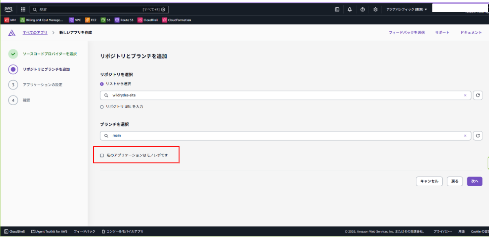

## サイトを変更する

公式手順から変更なし。

---

# モジュール2: ユーザーを管理する

## Amazon Cognitoユーザープールを作成し、アプリをユーザープールと統合する

**AWS Management Consoleのアップデートによる変更あり。**

以下の設定でユーザープールを作成します。

| 項目              | 値                                       |
| --------------- | --------------------------------------- |
| ユーザープール名        | `WildRydes`                             |
| アプリケーションタイプ     | `シングルページアプリケーション (SPA)`                 |
| アプリケーションに名前を付ける | `wildrydes-site`                        |
| サインイン識別子のオプション  | `メールアドレス`                               |
| 自己登録            | 自己登録を有効化                                |
| サインアップのための必要属性  | `email`                                 |
| リターンURL         | Amazon AmplifyでデプロイされたWild RydesサイトのURL |

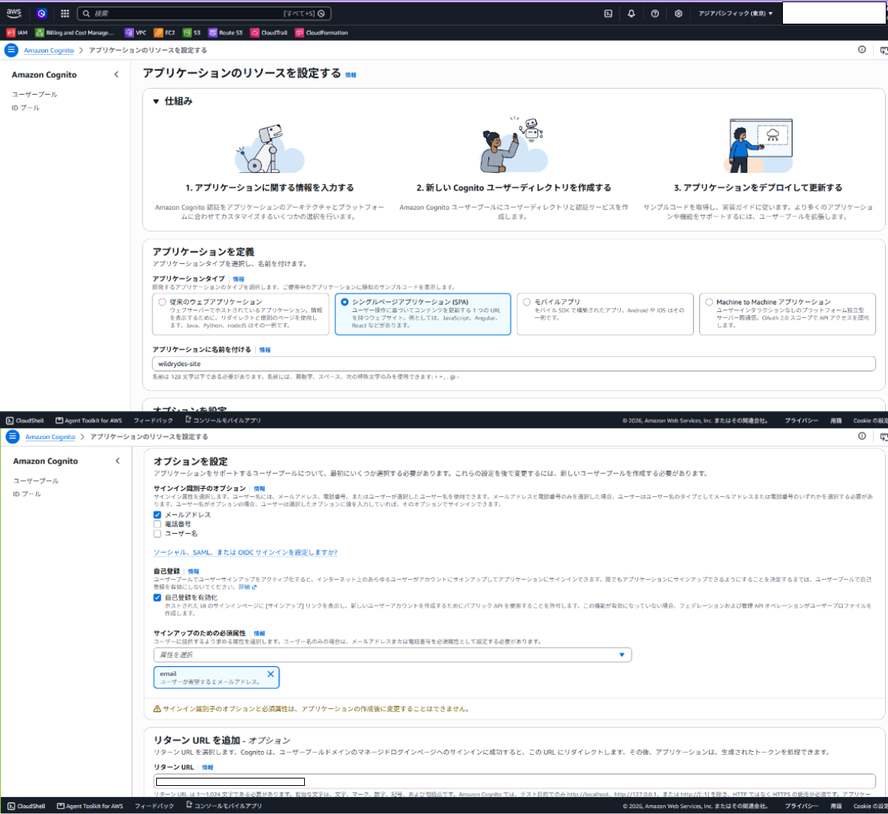

## ウェブサイトの設定ファイルを更新する

**変更あり。**

### `aws-exports.js` を作成する

以下のファイルを作成します。

```text
./wild-rydes/src/aws-exports.js
```

テンプレートは以下に配置しています。

```text
./hands_on_files/wild-rydes/src/aws-exports.js
```

### Cognitoの設定情報を記載する

以下のファイルに設定情報を記載します。

```text
./wild-rydes/src/aws-exports.js
./wild-rydes/public/js/config.js
```

> [!NOTE]
> それぞれのファイルの役割は異なります。
>
> * `src/aws-exports.js`
>
>   * フロントエンドからAmazon Cognitoを利用するための設定
> * `public/js/config.js`
>
>   * 公式サンプルで使用されるWebサイト側の設定ファイル
>
> 今回は `amplify` フォルダを削除したことで `aws-exports.js` が自動生成されなくなったため、  
> 手動で作成しています。

> [!WARNING]
> `aws-exports.js` に含まれるCognitoのUser Pool IDやClient IDなどは、  
> パスワードやアクセスキーなどの秘密情報とは異なります。
>
> ただし、公開リポジトリへ掲載する設定値については、  
> 実際のAWS環境における値や構成を確認したうえで公開してください。
>
> IAMアクセスキー、シークレットアクセスキー、パスワードなどの秘密情報は絶対にコミットしないでください。

## ローカルでビルドする

以下を実行します。

```bash
npm run build
```

## `aws-exports.js` をコミット対象に含める

```text
./wild-rydes/.gitignore
```

を開き、`aws-exports.js` の除外設定をコメントアウトまたは削除します。

## Amplifyへデプロイする

公式手順から変更なし。

```bash
git add .
git commit -m "new_config"
git push
```

## 実装を検証する

**変更あり。**

> [!CAUTION]
> 本ハンズオンでは、公開URLからユーザー登録を行うため、一時的にCognitoの自己登録を有効化します。
>
> 自己登録を有効にしたままにすると、意図しないユーザー登録やAPI利用につながる可能性があります。
>
> テストユーザーの登録が完了したら、不要な期間は自己登録を無効化してください。
>
> また、Cognitoコンソールからテストユーザーを手動作成する方法もあります。

### 一時的に外部からのユーザー登録を有効化する

```text
Amazon Cognito
  → ユーザープール
    → {作成したユーザープール}
      → 認証
        → サインアップ
```

`セルフサービスのサインアップ` を「有効」にします。

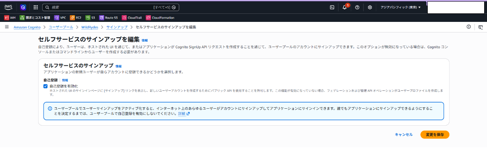

### ユーザー登録をする

Wild Rydesサイトからユーザー登録を行い、受信したメールからメールアドレスを検証します。

| 項目           | 値                  |
| ------------ | ------------------ |
| Username     | 受信可能なテスト用メールアドレス   |
| Password     | 任意の複雑なパスワード        |
| Email        | Usernameと同じメールアドレス |
| Phone number | 携帯電話の電話番号          |

### 外部からのユーザー登録を無効化する

テストユーザーの登録が完了したら、以下から `セルフサービスのサインアップ` を「無効」に戻します。

```text
Amazon Cognito
  → ユーザープール
    → {作成したユーザープール}
      → 認証
        → サインアップ
```

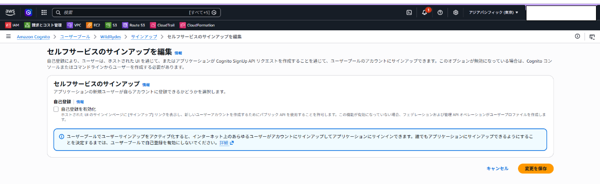

---

# モジュール3: サーバーレスサービスバックエンド

## Amazon DynamoDBテーブルを作成する

公式手順から変更なし。

## Lambda関数のIAMロールを作成する

公式手順から変更なし。

## リクエスト処理のためにLambda関数を作成する

**変更あり。**

### Lambdaランタイムを変更する

公式手順で使用されているLambdaランタイムが現在の環境ではサポート対象外となっているため、  
`Node.js 24.x` を使用します。

| 項目        | 値                 |
| --------- | ----------------- |
| オプション     | `一から作成`           |
| 関数名       | `RequestUnicorn`  |
| ランタイム     | `Node.js 24.x`    |
| カスタム実行ロール | `WildRydesLambda` |

### `index.mjs` を置き換える

Lambda関数に既存の `index.mjs` を設定する代わりに、以下のファイルを使用します。

```text
./hands_on_files/Lambda/index.mjs
```

> [!NOTE]
> Node.jsランタイムの変更に伴い、現行環境で動作するようLambda関数のコードを修正しています。

## 実装を検討する

公式手順から変更なし。

---

# モジュール4: RESTful APIをデプロイする

## 新しいREST APIを作成する

**AWS Management Consoleのアップデートによる変更あり。**

| 項目             | 値                                  |
| -------------- | ---------------------------------- |
| APIタイプ         | `REST API`                         |
| APIの詳細         | `新しいAPI`                           |
| API名           | `WildRydes`                        |
| APIエンドポイントタイプ  | `リージョン`                            |
| セキュリティポリシー     | `SecurityPolicy_TLS13_1_2_2021_06` |
| エンドポイントアクセスモード | `ベーシック`                            |
| IPアドレスのタイプ     | `IPv4`                             |

## オーソライザーを作成する

**AWS Management Consoleのアップデートによる変更あり。**

### リソースの作成

公式手順から変更なし。

### メソッドを作成

公式手順から変更なし。

### メソッドリクエストの設定

以下の設定にします。

| 項目               | 値           |
| ---------------- | ----------- |
| 認可               | `WildRydes` |
| 認可スコープ           | `-`         |
| リクエストバリデータ       | `なし`        |
| APIキーは必須です       | `□`         |
| オペレーション名 - オプション | `-`         |

---

# 【追加】API Gatewayの設定を修正する

公式ハンズオンに加えて、現在の環境では以下の設定変更が必要でした。

## CORSを有効化する

API Gatewayの `Wild Rydes` APIでCORSを設定します。

`Access-Control-Allow-Methods` に以下を設定します。

```text
# Before

Access-Control-Allow-Methods

□ OPTIONS
□ POST


# After

Access-Control-Allow-Methods

☑ OPTIONS
☑ POST
```

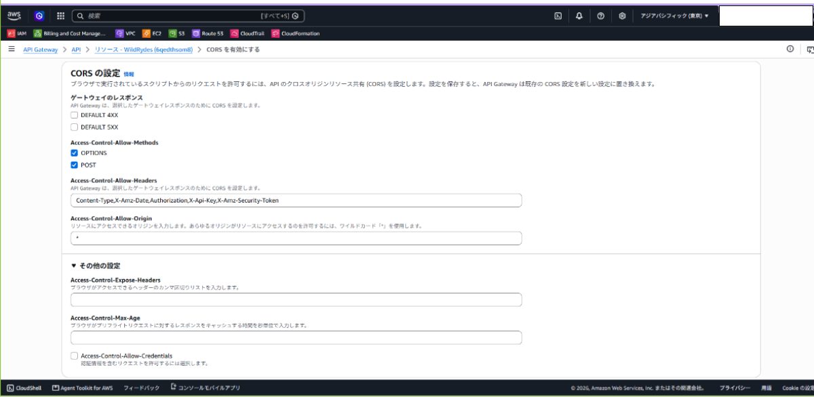

## Lambdaプロキシ統合を有効化する

Lambda統合の設定を以下のように変更します。

```text
Lambda プロキシ統合
False → True

レスポンス転送モード
バッファード
```

> [!NOTE]
> Lambdaプロキシ統合を利用すると、API GatewayからLambdaへリクエストを渡し、  
> Lambdaから返されたレスポンスをHTTPレスポンスとして扱う構成になります。
>
> また、Lambdaプロキシ統合を利用する場合、  
> CORSに必要なレスポンスヘッダーをバックエンド側で返す必要があります。

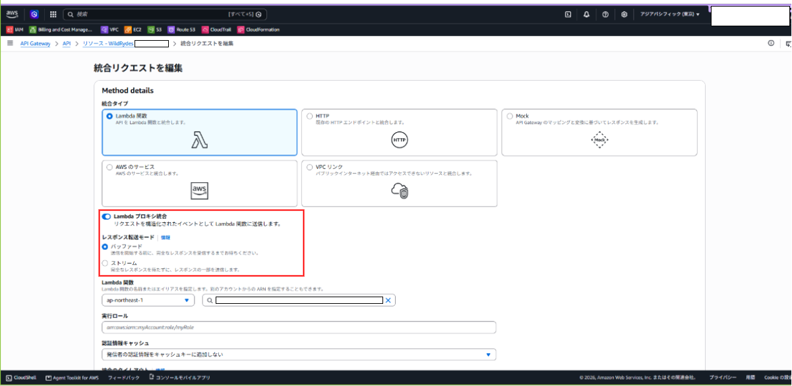

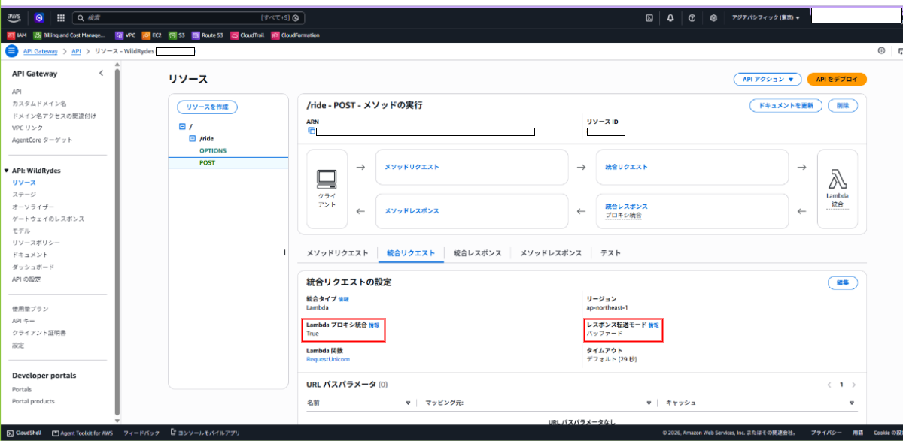

## APIをデプロイする

公式手順から変更なし。

## ウェブサイトの設定を更新する

**変更あり。**

以下のファイルに、Amazon API Gatewayコンソールからコピーした呼び出しURLを設定します。

```text
./wild-rydes/src/config.js
```

> [!NOTE]
> `./wild-rydes/public/js/config.js` にAPI GatewayのURLを設定する必要はありません。
>
> API Gatewayの接続先は `src/config.js` で設定します。

## 実装を検討する

公式手順から変更なし。

---

# 最終構成

最終的には、以下のような構成になります。

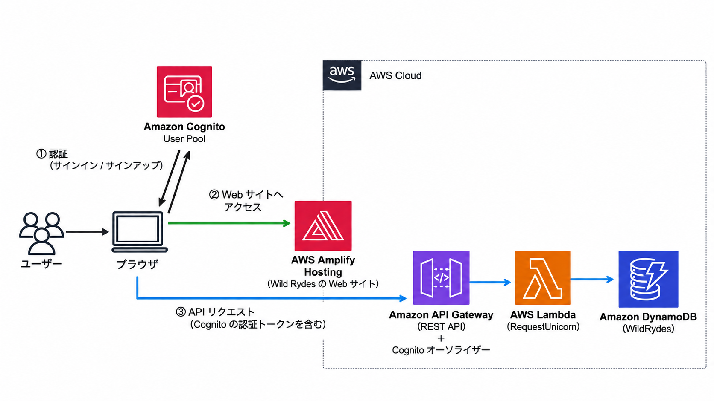

---

# 参考文献

* [サーバーレスのウェブアプリケーションを構築する](https://aws.amazon.com/jp/getting-started/hands-on/build-serverless-web-app-lambda-apigateway-s3-dynamodb-cognito/)
* [aws-samples/aws-serverless-webapp-workshop](https://github.com/aws-samples/aws-serverless-webapp-workshop)
* [AWS Lambda - Node.js](https://docs.aws.amazon.com/ja_jp/lambda/latest/dg/lambda-nodejs.html)
* [API GatewayでのLambdaプロキシ統合](https://docs.aws.amazon.com/ja_jp/apigateway/latest/developerguide/set-up-lambda-proxy-integrations.html)
* [CORS for REST APIs in API Gateway](https://docs.aws.amazon.com/apigateway/latest/developerguide/how-to-cors.html)
* [【AWS】Cognitoハンズオン - サーバーレスのウェブアプリケーションを構築する](https://qiita.com/onishi_820/items/4b8ac525e6866f3e7eb2)
* [サーバーレスのウェブアプリケーションを構築する ハンズオンでハマった落とし穴と解決策](https://engineers.fenrir-inc.com/entry/2025/04/14/151744)
